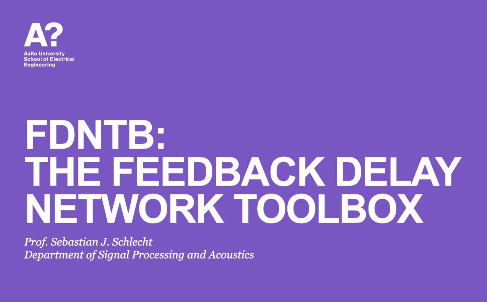

# FDNTB: The Feedback Delay Network Toolbox
Matlab Toolbox for Feedback Delay Networks (FDNs). The accompanying paper is

*Sebastian J. Schlecht, "FDNTB: The Feedback Delay Network Toolbox", DAFx 2020, Vienna, Austria.*

If you use this toolbox for your research, please cite the accompanying paper.

Feedback delay networks (FDNs) are recursive filters, which are widely used for artificial reverberation and decorrelation. This toolbox implements a wide range of variants and analysis methods.

* Feedback Matrix designs, scalar, delay, and filter matrices
* Absorption filter design
* Time-varying matrix design
* Modal decomposition for spectral analysis
* Allpass filter design
* FDN representations such as delay state space, state space, rational polynomials  

A wide range of applications is demonstrated in the example folders.

To run all example files, please call 

```
startup
run_all_examples
```

## Presentation and Demo

[](https://www.sebastianjiroschlecht.com/publication/schlecht-2020/ "Watch Video on Publication page")

## Required Dependencies

* MATLAB 2017b or newer
* Signal Processing Toolbox
* Symbolic Math Toolbox
* DSP System Toolbox

* (Control System Toolbox)
* (Curve Fitting Toolbox)
* (System Identification Toolbox)
* (Optimization Toolbox)
* (Simulink Control Design)
* (Statistics and Machine Learning Toolbox)
* (Computer Vision Toolbox)


The toolbox was tested on
* OSX 10.14.6, MATLAB R2019a
* Windows 10, MATLAB R2017b 

